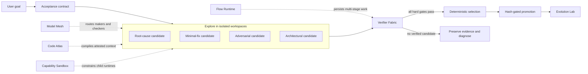

<p align="center">
  <picture>
    <source media="(prefers-color-scheme: dark)" srcset="assets/brand/prime-butterfly.svg">
    
  </picture>
</p>

<h1 align="center">Oh My Prime</h1>

<p align="center">
  <strong>Verified Recursive Agent Runtime</strong>
  <br />
  Explore competing solutions. Prove them against one contract. Promote only verified work.
</p>

<p align="center">
  <a href="https://github.com/oxura/oh-my-prime/actions/workflows/ci.yml"></a>
  <a href="LICENSE"></a>
  
  
</p>

<p align="center">
  <a href="#quick-start">Quick start</a> &bull;
  <a href="#why-oh-my-prime">Why Oh My Prime</a> &bull;
  <a href="#verified-runtime">Features</a> &bull;
  <a href="#architecture">Architecture</a> &bull;
  <a href="packages/coding-agent/docs/index.md">Documentation</a>
</p>

---

**Oh My Prime** is a fork of [Prime Agent](https://github.com/PrimeIntellect-ai/prime-agent) for software work where one plausible implementation is not enough.

Prime Agent already provides the right foundation: a persistent IPython control plane, recursive agents, daemon-backed sessions, direct agent messaging, long-running goals, compaction, and an extensible continual harness. Oh My Prime keeps that foundation and adds a verified decision layer around it:

```text
Explore  ->  Prove  ->  Promote  ->  Learn
```

Instead of trusting the first trajectory that looks convincing, Oh My Prime can create strategy-diverse candidates in isolated workspaces, verify every candidate against the same immutable acceptance contract, select only a fully verified result, promote the exact attested patch, and turn proven outcomes into replay-tested knowledge.

This is not Prime Agent with dozens of unrelated tools. The new systems are composable Python modules inside the same persistent RLM control plane.

## Why Oh My Prime

Most coding agents follow one path:

```text
interpret -> implement -> test -> declare success
```

If the initial interpretation is wrong, every later step inherits the mistake. More agents do not automatically solve this: without isolation, common acceptance criteria, independent verification, and a safe promotion boundary, a swarm is only more concurrent guesswork.

Oh My Prime changes the unit of work from **one generated patch** to **a set of competing, independently proved candidates**.

- **Search instead of premature commitment.** Deliberately different strategies explore the solution space.
- **Evidence instead of confidence.** Deterministic gates and bug reproducers decide whether a claim is true.
- **Isolation instead of shared-worktree races.** Every candidate receives a separate managed Git worktree.
- **Exact promotion instead of blind merging.** The promoted patch must match the digest that was verified.
- **Verified learning instead of trajectory folklore.** Harness memory changes only after evidence, replay, shadow evaluation, and promotion.
- **Fail closed instead of choosing the least-bad failure.** If no candidate passes every hard requirement, no candidate wins.

## Architecture



The model-facing API remains Python. TypeScript owns provider access, durable session state, child admission, enforcement, and authoritative host operations.

## Verified Runtime

| System | What it does | Core guarantee |
| --- | --- | --- |
| [**ProofTree**](packages/coding-agent/skills/prime/SKILL.md) | Runs 2–8 strategy-diverse implementations through recursive agents. | A failed or incomplete candidate cannot win; no verified result means no promotion. |
| [**Verifier Fabric**](packages/coding-agent/skills/prove/SKILL.md) | Creates commit-bound requirements, invariants, command gates, before/after reproducers, and evidence ledgers. | Promotion is permitted only for the exact candidate snapshot covered by a verified report. |
| [**Workspace Manager**](packages/coding-agent/skills/workspace/SKILL.md) | Creates durable Git worktrees, captures binary-safe diffs, detects stale bases, and manages promotion or discard. | Candidate changes never silently overwrite work added to the target after the fork. |
| [**Model Mesh**](packages/coding-agent/skills/models/SKILL.md) | Resolves semantic routes such as `fast`, `code`, `deep`, `review`, `vision`, and `private-local`. | Routing uses authenticated capabilities and objective verifier outcomes, not model self-rating. |
| [**Code Atlas**](packages/coding-agent/skills/atlas/SKILL.md) | Builds a content-addressed graph of files, symbols, imports, calls, references, and inheritance. | Context capsules and impact reports carry source hashes, provenance, freshness, and explicit limitations. |
| [**Evolution Lab**](packages/coding-agent/skills/evolve/SKILL.md) | Separates hypotheses from verified knowledge and evaluates proposed harness changes through replay and shadow runs. | Active memory changes transactionally and can be rolled back when evidence becomes stale. |
| [**Flow Runtime**](packages/coding-agent/skills/flow/SKILL.md) | Runs durable dependency graphs with typed artifacts, budgets, retries, resource locks, quorum joins, and recovery. | Succeeded tasks are not rerun after recovery, and prose is never treated as a declared artifact. |
| [**Capability Sandbox**](packages/coding-agent/docs/rlm.md#2-subagents-are-native-rlm-calls) | Gives each child a non-widening filesystem, network, secret, process, memory, CPU, and wall-time manifest. | Constrained child startup fails when the requested boundary cannot be enforced. |

### ProofTree

ProofTree turns speculative multi-agent work into a controlled search process:

1. Create one acceptance contract before implementation.
2. Fork a clean, isolated workspace for every strategy.
3. Give each candidate an independent recursive agent session.
4. Run the same verifier contract against every completed candidate.
5. Reject missing, errored, failed, incomplete, mutated, or stale candidates.
6. Rank fully verified candidates deterministically.
7. Promote only the patch digest recorded by the evidence ledger.

```python
contract = await prove.contract(
    "Prevent duplicate queue claims",
    requirements=[
        prove.Requirement("NO-DUP", "A job is never owned by two workers"),
        prove.Requirement("NO-LOSS", "Every queued job remains claimable"),
    ],
    gates=[
        prove.reproducer(
            ["python", "tests/reproduce_duplicate_claim.py"],
            id="duplicate-reproducer",
            proves=["NO-DUP"],
        ),
        prove.command(
            ["npm", "run", "check"],
            id="repository-check",
            proves=["NO-LOSS"],
        ),
    ],
)

run = await prime.explore(
    "Prevent duplicate queue claims",
    contract=contract,
    candidates=4,
    strategies=["root-cause", "minimal-fix", "adversarial", "concurrency-first"],
)

await run.wait(timeout_seconds=3600)
winner = await run.best_verified(max_parallel=2)
await winner.promote()
```

`prime`, `prove`, `workspace`, `models`, `atlas`, `evolve`, and `flow` are preloaded in the persistent IPython kernel. Runs, manifests, reports, artifacts, and child registries are durable across compaction and process restarts.

### Verifier Fabric

A verifier report records the evidence needed to audit a claim:

- exact argv and resolved working directory;
- baseline and candidate revisions;
- requirement-to-gate coverage;
- exit code, timeout state, duration, and timestamps;
- bounded output previews plus full stdout and stderr artifacts;
- SHA-256 hashes for artifacts, candidate snapshots, and promoted patches;
- one of three explicit outcomes: `verified`, `failed`, or `incomplete`.

A reproducer gate must fail on a fresh baseline and pass on the candidate. Verification snapshots the candidate before and after the complete gate run; a test that mutates the patch invalidates verification instead of laundering an unverified change into promotion.

### Model Mesh

Reusable orchestration names a role instead of hard-coding a vendor model:

```python
maker = await rlm(
    "Implement the candidate",
    route="code",
    task_type="typescript-refactor",
    cwd=str(candidate.path),
)

checker = await rlm(
    "Adversarially review the contract, diff, and evidence",
    route="review",
    independent_of=maker,
    different_provider=True,
    cwd=str(candidate.path),
)
```

Model Mesh filters authenticated models by reasoning, vision, context, privacy, and local availability. It ranks eligible candidates using route affinity, price where relevant, a verifier-backed success posterior, and bounded exploration. Maker/checker separation fails closed when an independent provider cannot be selected.

### Code Atlas and Context Compiler

Code Atlas is not vector search over arbitrary chunks. It indexes semantic declarations and relationships with the repository's Python AST and TypeScript compiler configuration, then compiles the smallest relevant context under a hard token budget.

Every context excerpt includes its file, line range, content hash, source hash, inclusion reason, and related symbols. Stale graphs can rebuild automatically; stale capsules and impact reports are rejected when their underlying bytes change.

### Evolution Lab

Continual harness changes follow their own proof pipeline:

```text
trajectory -> candidate -> evidence validation -> replay -> shadow -> promotion
```

A successful session cannot directly rewrite active memory. Verified knowledge and known errors require attested Verifier Fabric evidence. Hypotheses remain hypotheses. Promotion requires separate non-regressing replay and shadow reports, unchanged lineage, and a clean target. Maintenance revalidates evidence and automatically rolls back stale active memory without overwriting later unrelated edits.

### Durable Flow Runtime

Flow is for recursive work with real dependencies or restart requirements:

```python
run = await flow.create(
    "Migrate the service safely",
    budget=flow.FlowBudget(max_attempts=20, max_tokens=250_000, wall_time_seconds=3600),
    max_parallel=4,
)

audit = await run.task(
    "Audit the architecture",
    route="fast",
    produces=(flow.ArtifactSpec("architecture", required_keys=("modules", "risks")),),
)

design = await run.task(
    "Design the migration",
    route="deep",
    requires=(audit.id,),
    consumes=("architecture",),
    produces=(flow.ArtifactSpec("plan", required_keys=("steps",)),),
)

result = await run.run()
```

Tasks communicate through validated, content-addressed JSON artifacts rather than relying on human-readable chat history. The graph persists before execution and after every state transition.

## What We Keep from Prime Agent

Oh My Prime is an extension of a strong runtime, not a rewrite of it.

- **Persistent IPython:** Python variables, imports, parsed data, functions, and task handles survive across calls and compaction.
- **Recursive AgentSessions:** children are real sessions with their own context, lifecycle, artifacts, and optional persistent kernel.
- **Daemon-backed execution:** sessions continue while the TUI detaches and reconnect through a versioned local protocol.
- **Agent-to-agent messaging:** parents, siblings, and children exchange attributed messages without collapsing everything into one context.
- **Long-running work:** goals, heartbeats, schedules, autonomous continuations, recovery, and durable session trees share one runtime.
- **Provider ecosystem:** subscription and API-key providers, custom models, custom providers, and per-model reasoning levels remain available.
- **Extensibility:** Python-backed skills, TypeScript extensions, MCP integrations, SDK, ACP, RPC, JSON event streams, and custom TUI components remain supported.
- **Session ergonomics:** branching, compaction, tree navigation, attachments, configurable keybindings, themes, and searchable settings are retained.

## Compared with Prime Agent

Prime Agent remains the upstream foundation. The distinction is how complex work is searched, judged, integrated, and learned from.

| Area | Prime Agent foundation | Oh My Prime |
| --- | --- | --- |
| Solution search | One main trajectory plus caller-orchestrated recursive children. | Built-in strategy-diverse candidate exploration with independently isolated work. |
| Workspace ownership | Child `cwd` and worktree discipline are managed by the caller. | Durable managed worktrees, immutable manifests, binary-safe snapshots, and stale detection. |
| Acceptance criteria | General prompts, tests, quality gates, and reviewer judgment. | Commit-bound requirements, invariants, coverage-aware gates, reproducers, and persisted evidence ledgers. |
| Winner selection | The user or agent decides which result is best. | Only fully verified candidates are eligible; ties use deterministic patch and verifier metrics. |
| Integration | Apply or merge a chosen result. | Promote only the unchanged SHA-256-attested patch against the unchanged base. |
| Model selection | Exact model selection and inherited child configuration. | Semantic routes, capability filtering, local verified outcome history, and provider-independent maker/checker policies. |
| Repository context | Persistent Python plus ordinary repository tools and user-selected context. | Semantic graph, budget-bounded provenance-rich capsules, impact analysis, and stale-source rejection. |
| Continual learning | Harness refinement based on session trajectories and review. | Evidence-backed candidates, category separation, confidence decay, replay, shadow evaluation, promotion, and rollback. |
| Orchestration | Durable sessions, goals, schedules, messages, and recursive calls. | Typed dependency DAGs with atomic artifacts, budgets, retries, resource exclusion, quorum joins, and recovery. |
| Child containment | Process separation is not itself a security sandbox. | Fail-closed, non-widening capability manifests enforced through supported operating-system primitives. |

Choose upstream Prime Agent when you want the smallest version of its recursive programming model. Choose Oh My Prime when the cost of a convincing but wrong patch is higher than the cost of exploring and proving alternatives.

## Quick Start

### Requirements

- Node.js 22 or newer
- npm 11.10 or newer
- Git
- Python 3.10 or newer
- Linux or macOS for enforced child capability sandboxes

Linux child sandboxes also require `ripgrep`, `bubblewrap`, and `socat`:

```bash
# Debian / Ubuntu
sudo apt install ripgrep bubblewrap socat

# Fedora
sudo dnf install ripgrep bubblewrap socat
```

macOS uses the built-in Sandbox Runtime integration.

### Run from source

```bash
git clone https://github.com/oxura/oh-my-prime.git
cd oh-my-prime
npm install
./ompr
```

To use the source checkout while working in another repository, invoke the launcher by absolute path. The agent keeps the calling directory as its workspace:

```bash
cd /path/to/your/project
/path/to/oh-my-prime/ompr
```

Release installations expose the bare command:

```bash
ompr
```

On first launch, use `/login` to configure a subscription or API-key provider. Existing `prime-agent` authentication, settings, session, and state paths remain compatible with the fork.

### Everyday operation

Oh My Prime still works as a direct interactive coding agent. ProofTree is an escalation path for changes that justify independent candidates, not a mandatory tax on every typo.

- Use ordinary prompts for focused inspection and low-risk edits.
- Use `/model` or `/login` to configure authenticated providers.
- Use `/settings` for runtime, interface, and verification preferences.
- Use `/tree` and the agents view to navigate recursive session families.
- Use persistent goals, heartbeats, schedules, and autonomous mode for long-running work.
- Ask the agent to use ProofTree for risky bugs, concurrency, migrations, broad refactors, security-sensitive changes, or ambiguous designs.

## Security and Trust Model

> [!IMPORTANT]
> The top-level session executes model-generated Python and project commands with the current user's operating-system permissions. It is a durable control environment, not a security sandbox.

Capability manifests apply to constrained RLM child kernels. On supported Linux and macOS hosts, child filesystems, network access, secrets, process count, memory, CPU, wall time, private state, runtime sockets, and credential exposure are restricted at admission. Nested children may narrow the inherited manifest but cannot widen it. Missing enforcement support or a malformed attestation rejects the child instead of launching it unsandboxed.

Host-side extensions, custom tools, and the top-level kernel remain outside that child boundary. Use trusted repositories and extensions, inspect promoted patches, and use a stronger external sandbox for hostile host-side code.

## Design Principles

1. **Proof over prose.** A model's confidence is never verification evidence.
2. **Contracts before candidates.** Requirements and hard gates are fixed before implementations compete.
3. **Isolation by default.** Independent implementers do not edit the same working tree.
4. **No least-bad promotion.** Failed and incomplete branches remain failures.
5. **Exact bytes matter.** Verification, freshness, and promotion are bound by content hashes.
6. **Maker and checker are independent.** Different providers are preferred and can be required.
7. **Context has provenance.** Every selected excerpt explains where it came from and why it was included.
8. **Durable state is typed.** Important coordination survives restarts in structured records and artifacts, not only chat text.
9. **Learning is reversible.** New memory must prove itself and can be invalidated or rolled back.
10. **Claims stop at the evidence boundary.** Unsupported assumptions and platform limits remain explicit.

## Documentation

| Topic | Documentation |
| --- | --- |
| Start here | [Documentation index](packages/coding-agent/docs/index.md) · [Quickstart](packages/coding-agent/docs/quickstart.md) · [Usage and CLI](packages/coding-agent/docs/usage.md) |
| Runtime architecture | [Architecture](packages/coding-agent/docs/architecture.md) · [RLM programming model](packages/coding-agent/docs/rlm.md) · [Daemon](packages/coding-agent/docs/daemon.md) |
| Verified execution | [ProofTree](packages/coding-agent/skills/prime/SKILL.md) · [Verifier Fabric](packages/coding-agent/skills/prove/SKILL.md) · [Workspace Manager](packages/coding-agent/skills/workspace/SKILL.md) |
| Intelligence | [Model Mesh](packages/coding-agent/skills/models/SKILL.md) · [Code Atlas](packages/coding-agent/skills/atlas/SKILL.md) · [Evolution Lab](packages/coding-agent/skills/evolve/SKILL.md) |
| Orchestration | [Flow Runtime](packages/coding-agent/skills/flow/SKILL.md) · [Long-running agents](packages/coding-agent/docs/long-running-agents.md) |
| Customization | [Skills](packages/coding-agent/docs/skills.md) · [Extensions](packages/coding-agent/docs/extensions.md) · [MCP](packages/coding-agent/docs/mcp-integrations.md) · [Themes](packages/coding-agent/docs/themes.md) |
| Integrations | [SDK](packages/coding-agent/docs/sdk.md) · [ACP](packages/coding-agent/docs/acp.md) · [RPC](packages/coding-agent/docs/rpc.md) · [JSON events](packages/coding-agent/docs/json.md) |
| Development | [Development guide](packages/coding-agent/docs/development.md) · [Package layout](packages/coding-agent/docs/packages.md) |

## Project Relationship

Oh My Prime is based on [Prime Agent](https://github.com/PrimeIntellect-ai/prime-agent), which is built on [`pi`](https://github.com/earendil-works/pi). Those upstream projects remain the source of the persistent IPython, recursive-agent, daemon, session, provider, and terminal foundations.

Oh My Prime focuses on the layer above that foundation: searching multiple implementations, proving observable requirements, safely promoting exact work, routing compute from verified outcomes, understanding repository structure, and learning only through reversible evidence-backed transitions.

## Contributing

Read the [development guide](packages/coding-agent/docs/development.md), keep changes focused, and run `npm run check` before submitting a pull request. Changes to verified runtime guarantees should include the focused regression coverage that demonstrates the claimed invariant.

## License

Oh My Prime is released under the [MIT License](LICENSE).
