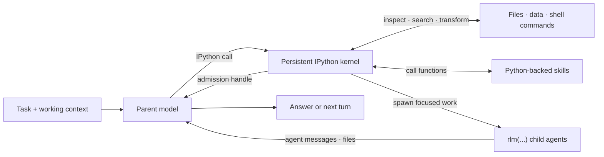

# RLM Programming Model

Prime Agent is built around a recursive language model (RLM) runtime: the model works inside a persistent Python control environment and composes capabilities as code. Provider calls, session persistence, child lifecycles, scheduling, and safety policy remain in the TypeScript host; IPython is the model-facing programming surface.

## RLM Loop



The parent keeps its own context focused while Python holds working state and child agents receive only the context needed for their subtasks.

## Core Invariants

### 1. Execution is programmatic

The default RLM runtime exposes one built-in model tool: `ipython`. Reading and editing files, running project commands, transforming results, invoking skills, and delegating work all begin from that persistent kernel instead of separate built-in tool calls.

Python state survives across tool calls and compaction. Variables, imports, functions, parsed results, and task handles remain available on later turns:

```python
from pathlib import Path

config_files = list(Path(".").rglob("*.toml"))
large_files = [path for path in config_files if path.stat().st_size > 10_000]
```

Run a project's normal commands through its own environment from an IPython cell:

```bash
%%bash
npm run check
```

Each `%%bash` cell is a temporary subshell, while Python state and `%cd` changes persist in the kernel. Prime Agent extensions may intentionally add custom tools, but the built-in RLM design does not require a separate model tool for every capability.

### 2. Subagents are native RLM calls

The callable `rlm` object is preloaded in the kernel. Spawn a child with a direct call:

```python
handle = await rlm(
    "Review the authentication flow for security issues",
    name="auth-reviewer",
    cwd="/path/to/isolated-worktree",
)
print(
    handle.rlm_child_id,
    handle.name,
    handle.session_dir,
    handle.model,
    handle.cwd,
    handle.capabilities,
)
```

The call returns immediately after task admission with a child handle; it never waits for or returns the child's answer. The TypeScript host creates an independent child `AgentSession`. The child inherits the parent model, configured Python skills, retry policy, and resource loader, but its only model tool is the sandboxed persistent `ipython` kernel. Pass `cwd` to select an existing workspace; relative paths resolve from the parent cwd. Pass `effort` to select a per-child reasoning level, clamped to the chosen model.

Every child receives a fail-closed capability manifest. The default grants read and write access under the child cwd, denies outbound network and secrets, limits the process tree to 64 processes, and stops it after 20 minutes. Narrow or explicitly extend that boundary at admission:

```python
child = await rlm(
    "Fix auth token rotation and run focused checks",
    cwd="/path/to/isolated-worktree",
    capabilities={
        "filesystem": {
            "read": ["src/**", "tests/**"],
            "write": ["src/auth/**", "tests/auth/**"],
        },
        "network": {"allow": ["registry.npmjs.org"], "deny_by_default": True},
        "secrets": {"allow": []},
        "process": {
            "cpu": 4,
            "memory_bytes": "4gb",
            "wall_time_ms": "20m",
            "max_processes": 64,
        },
    },
)
```

Filesystem paths resolve against the child cwd. Secret grants name exact environment variables; values are brokered into a minimal environment rather than inherited wholesale. The agent configuration directory, authentication store, global harness, and host-resolved MCP configuration handlers are never mounted into a constrained child. Durable skill state uses a private `XDG_STATE_HOME` and a dedicated writable local-harness directory. The surrounding `RLM_SESSION_DIR`, including descendant session and sandbox-control files, is not exposed; the host rebinds only the current child's exact runtime files. Network access is a domain allowlist, and `network=False` denies outbound IP access. Nested children inherit the parent's manifest when omitted and may only narrow filesystem paths, domains, secrets, and resource ceilings. Each manifest and OS-sandbox configuration is stored privately with the child session; a missing, malformed, mismatched, or modified attestation fails closed.

On Linux, enforcement uses Bubblewrap namespaces and the Sandbox Runtime proxy, with host-side process-tree RSS, process-count, and wall-time monitoring. Install `ripgrep`, `bubblewrap`, and `socat` before starting constrained children. Jupyter uses a private Unix socket; existing non-runtime Unix socket endpoints under granted filesystem roots are masked before launch. Do not create host service sockets inside a live child workspace. On macOS, Sandbox Runtime seatbelt profiles enforce socket paths and a host `ps` monitor enforces memory, process-count, and wall-time limits. CPU affinity is Linux-only. Missing platform support or sandbox startup failure rejects the child kernel instead of running it unsandboxed.

Reusable orchestration can request a semantic Model Mesh route instead of an exact provider model:

```python
child = await rlm(
    "Review the candidate",
    route="review",
    task_type="security",
    cwd="/path/to/isolated-worktree",
)
print(child.model, child.effort)
```

The bundled `models` skill resolves `fast`, `code`, `deep`, `review`, `vision`,
`long-context`, `private-local`, and `max` against authenticated capabilities
and verifier-backed local outcomes. `route` and `model` are mutually exclusive.

For maker/checker separation, route the checker independently from the admitted
maker. `different_provider=True` fails closed unless another authenticated
provider satisfies the checker route:

```python
maker = await rlm("Implement the candidate", route="code", cwd=workspace)
checker = await rlm(
    "Adversarially review the diff and verifier evidence",
    route="review",
    independent_of=maker,
    different_provider=True,
    cwd=workspace,
)
```

Spawn independent children in separate calls and end the turn instead of awaiting completion:

```python
api_review = await rlm("Review the public API", name="api-reviewer")
test_review = await rlm("Review the test coverage", name="test-reviewer")
integration_audit = await rlm("Run the slow integration audit", name="integration-audit")
```

Results arrive only through explicit `agent_message` replies or files, never as an `rlm()` return value. Children reply when an answer is needed:

```python
await agent_message.send(message, receiver_role="parent")
```

The parent can follow up with a retained child:

```python
await agent_message.send(
    "Check the newly added regression test.",
    receiver_role="child",
    receiver_name=api_review.name,
)
```

#### Child handles and lifecycle

An admission handle contains `rlm_child_id`, `name`, `session_dir`, `model`, `cwd`, the effective `effort`, and the canonical enforced `capabilities`. Child usage is attributed to the parent session while remaining distinguishable in context-tree reporting; registry entries expose cumulative successful provider-reported `usage_tokens` and use zero when a provider omits usage.

The parent-scoped child registry survives compaction, kernel restart, and parent restoration:

```python
children = await rlm.list_subagents()
for child in children:
    print(child.session_name, child.status, child.usage_tokens)
```

Successfully completed daemon-backed children remain addressable while their parent session is open. Delete a child only when its context is no longer needed:

```python
await rlm.delete_subagent(children[0])
```

The default recursion depth allows a root agent to create children. Raising the configured depth allows descendants to recurse further.

### 3. Skills add programmatic capability

Prime Agent supports the Agent Skills markdown format and extends it with Python-backed skills. Both use `SKILL.md` for discovery, routing, and instructions. A Python-backed skill also contains a Python package that Prime Agent installs into the kernel environment and exposes by import name.

For a skill named `release-audit`, the model can call:

```python
report = await release_audit(repository=".", target_version="0.4.0")
```

This makes Python-backed skills a superset of instruction-only skills: they can provide guidance, scripts, references, dependencies, typed callables, and optional shell commands. They may also call `rlm(...)` themselves when a capability needs recursive delegation.

Only skill metadata is placed in the startup prompt. The agent loads the full `SKILL.md` when the task matches, then inspects and calls the documented Python API. See [Skills](skills.md) for discovery, packaging, and the built-in skill-creation workflow.

### 4. State is designed to outlive one turn

The RLM programming model assumes useful work may take many turns or continue after the terminal UI closes:

- automatic compaction summarizes older context while preserving recent messages and kernel state;
- daemon-backed workers keep active sessions running after clients detach;
- child registries and session artifacts make subagents recoverable;
- heartbeats and scheduled prompts re-enter a session later;
- persistent goals continue until the objective is complete or the user changes their state; and
- autonomous mode adds bounded continuations and optional quality gates.

See [Long-Running and Background Agents](long-running-agents.md) for these lifecycle features.

## Host Bridge

Python skills use typed host requests for capabilities whose authoritative state belongs outside the kernel. For example, the `goal`, `agent_message`, `rlm_heartbeat`, and `compact` skills call `rlm.host_request(...)`; the TypeScript host validates the request and owns the state transition.

Credential-bearing MCP configuration handlers are available only to the unsandboxed top-level kernel. Capability-constrained children do not receive raw MCP URLs or headers; grant a child only the explicit network domains and environment secrets required by its task.

## Trust Model

The top-level IPython kernel runs model-generated Python and project commands with the worker's operating-system permissions. It remains a durable control environment, not a security sandbox. RLM child kernels are different: they are launched behind the capability boundary described above and fail closed when that boundary cannot be established. Review third-party extensions because host-side custom tools run outside a child kernel; capability-constrained children expose only `ipython` as a model tool.

For implementation details, see [RLM Runtime Architecture](rlm-runtime.md).
